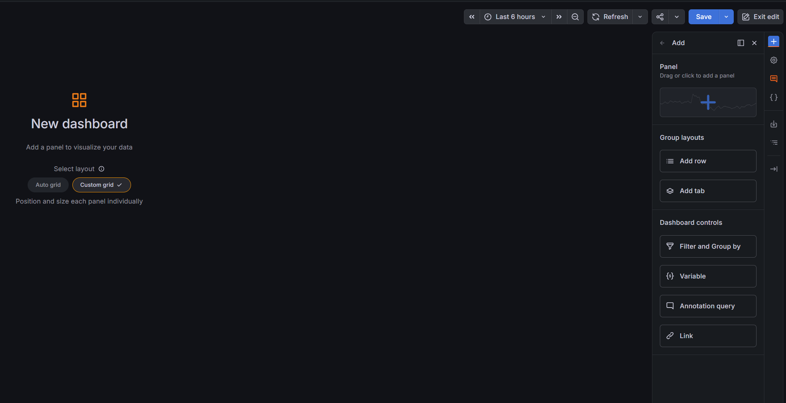

# 08 실습 — 첫 Dashboard와 숫자 패널

시작 조건: 07 실습에서 Mimir의 `up{job="node"}` 조회 성공. 실행 위치: Windows 브라우저, 로그인한 Grafana 13.2.3 영어 UI.

## 1. 빈 Dashboard 열기

왼쪽 메뉴 **Dashboards → 오른쪽 위 New → New dashboard** 순서로 선택합니다. 가운데 `New dashboard`와 오른쪽 `Add` 영역이 나타납니다. `Custom grid`를 선택한 상태로 진행합니다.



위 이미지는 실습자가 제공한 실제 화면입니다. 화면 오른쪽 끝 파란 `+`는 Add 영역을 여는 버튼입니다. Add 영역 안 **Panel 제목 아래 사각형의 가운데 큰 파란 `+`**는 패널을 추가하는 위치입니다. `Add row`나 `Add tab`은 패널이 아닌 화면 그룹을 만드는 버튼입니다.

## 2. 패널 편집 화면 열기

1. 오른쪽 **Panel** 상자 안의 큰 `+`를 클릭합니다.
2. 새 상자가 Dashboard에 추가되면 그 안의 **Configure visualization**을 클릭합니다.
3. 패널 편집 화면에서 미리보기 아래 **Queries** 탭을 찾습니다.
4. **Data source**를 **Mimir**로 선택합니다. 이미 Mimir면 그대로 둡니다.

정상 결과: 위쪽 미리보기와 아래쪽 쿼리 A 편집 영역이 보입니다. 메뉴를 찾지 못하면 [화면 안내](../screen-help.md)를 확인하세요.

## 3. 쿼리 입력

쿼리 A의 **Code**를 클릭해 직접 입력 모드로 바꾸고 기존 내용을 아래 문장으로 교체합니다.

```promql
up{job="node",node="observability-lab-worker"}
```

오른쪽 위 **Refresh**를 누릅니다. 이 문장은 node 수집 작업 중 worker의 결과만 요청합니다. 미리보기에 데이터가 나타나는지 먼저 확인합니다.

## 4. 큰 숫자로 표현

1. 표현 방식 선택 영역에서 **All visualizations**를 엽니다. 이미 시각화를 선택한 화면이면 현재 시각화 이름을 클릭해 목록을 엽니다.
2. 검색에 `Stat`을 입력하고 **Stat**을 선택합니다.
3. 오른쪽 옵션 영역의 **Panel options → Title**에 `Worker 메트릭 수집 상태`를 입력합니다.
4. **Value options → Calculation**은 **Last * (not null)**을 선택합니다. 시간 범위 안의 가장 최근 유효값을 표시합니다.
5. **Standard options → Decimals**에 `0`을 입력합니다.

정상 결과: 큰 숫자 `1`이 나타납니다. 색은 기본 설정에 따라 달라도 됩니다. `No data`면 시각화 설정을 더 바꾸기 전에 07 실습의 Explore에서 같은 쿼리를 확인합니다.

## 5. Dashboard 저장

1. 화면 위 **Save**를 누릅니다.
2. Dashboard 이름 입력 창에 `Lab Infrastructure Basic`을 입력합니다.
3. Folder는 기본 General을 사용해도 됩니다. 새 폴더 만들기는 이번 단계에서 하지 않습니다.
4. 저장 창의 **Save**를 누릅니다.
5. **Back**으로 Dashboard에 돌아온 뒤 **Exit edit**를 누릅니다.
6. **Dashboards** 목록에서 방금 저장한 이름을 찾아 다시 엽니다.

위 시간 범위를 **Last 15 minutes**로 바꿉니다. 자동 새로고침은 **Refresh 오른쪽 화살표 → 30s**를 선택합니다. 편집 상태에서 다시 Save하여 선택을 저장합니다.

완료 확인: Dashboard를 다시 열었을 때 제목과 숫자 패널이 남아 있고 값이 `1`입니다. 아직 node 선택 목록이 없는 것이 정상입니다.

| 막힌 곳 | 확인 |
|---|---|
| 오른쪽 Add가 안 보임 | 편집 상태인지 확인하고 오른쪽 끝 파란 `+` 클릭 |
| Configure visualization 없음 | 이미 설정한 패널은 패널 메뉴의 Edit로 들어가기 |
| Stat 목록이 안 보임 | 현재 시각화 이름 또는 All visualizations에서 검색 |
| Save 뒤 이름이 없음 | 저장 창 안의 두 번째 Save까지 눌렀는지 |

[현재 버전의 Dashboard 편집 흐름](https://grafana.com/docs/grafana/v13.2/visualizations/dashboards/build-dashboards/create-dashboard/)

[먼저 읽을 설명](01-concept.md) · [목차](../README.md) · [다음 학습](../09-visualizations/01-concept.md)
