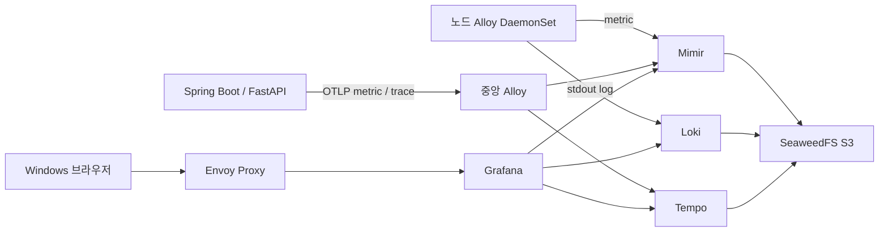

# WSL에서 직접 만드는 Grafana Observability 실습

Windows WSL2에서 Kubernetes 생성부터 metric·log·trace 수집, Grafana Dashboard 제작까지 진행하는 한국어 실습 교본이다. Kubernetes 기본을 아는 실습자를 대상으로 한다. 모든 설치 명령은 실습자가 실행한다.

PC RAM 32GB 이상, WSL 메모리 12~16GB(권장 16GB), WSL Linux 디스크 여유 40GB 이상을 준비한다. Docker Engine + kind 2노드, Cilium, Envoy Gateway, SeaweedFS, Mimir/Loki/Tempo 단일 프로세스, Alloy, Grafana를 사용한다. 버전은 [versions.env](config/versions.env)에 고정했다.



두 가지 진행 경로가 있다.

| 경로 | 진행 방법 |
|---|---|
| 처음부터 수동 실습 | [교본 목차](docs/README.md)의 00~09장을 순서대로 수행 |
| 같은 인프라 자동 구축 | [사전 준비](docs/01-wsl-and-tools.md) 후 `bash scripts/lab.sh up` 실행. 샘플 앱은 설치하지 않음 |

```bash
# 준비를 마친 WSL Bash, 저장소 루트에서 실행
bash scripts/lab.sh up
bash scripts/lab.sh access
# http://localhost:8080/grafana/
bash scripts/lab.sh status
# 실습 종료: 클러스터와 모든 관리 실습 데이터 삭제
bash scripts/lab.sh destroy
```

Pod가 재생성되어도 PVC/WAL에 저장된 데이터와 직접 만든 Dashboard를 유지한다. `destroy`는 전용 WSL 저장 경로까지 삭제한다. [보존·삭제 계약](docs/15-persistence-and-destroy.md)을 먼저 확인한다.

샘플은 **React의 Test 버튼 → Spring Boot `/test` → FastAPI `/test`**다. [별도 빌드·배포](docs/11-sample-build-and-deploy.md) 후 두 서버에 OTel 자동 계측을 적용한다. React는 계측하지 않는다. 두 서버의 JSON log와 Tempo trace 연결, 정상·지연·오류·timeout 분석을 실습한다.

Grafana 설치 직후에는 [인프라 Dashboard](docs/09-dashboard-infrastructure.md), 서버 계측 후에는 [서비스 Dashboard](docs/13-dashboard-services.md)를 빈 화면부터 직접 만든다. JSON 완성 예시는 비교·복습용이다.

- [버전 선택 근거](docs/appendix-versions.md)
- [Podman 대안](docs/appendix-podman.md)
- [검증 결과와 실습 확인 항목](docs/validation.md)

이 환경은 로컬 학습용이며 localhost로만 접근한다. 단일 프로세스·local PV의 관측 및 장애 범위를 교본에서 설명한다.
