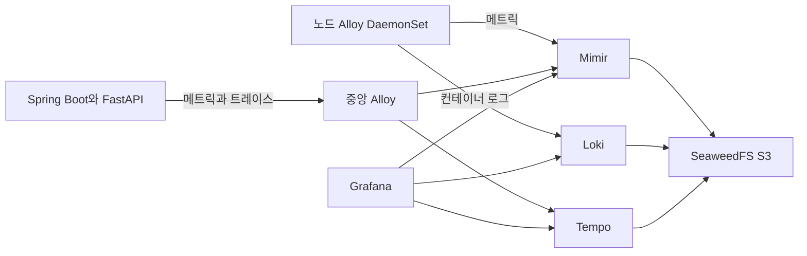

# Grafana Observability Practice — Basic

Windows WSL에서 직접 만드는 한국어 Observability 기초 실습입니다. kubectl 기본 명령을 아는 학습자가 메트릭·로그·트레이스를 처음부터 이해하고, 설치와 Grafana 화면 실습을 따라갈 수 있도록 **설명 페이지 → 실습 페이지**로 구성했습니다.

**[Basic 한국어 교본 시작하기](Guide/Basic/Korean/README.md)**

선행 과정은 [wsl_kubernetes_practice](https://github.com/ud0412/wsl_kubernetes_practice)입니다. WSL 설정과 kind Kubernetes, Cilium, Gateway API·Envoy Gateway 설치는 그 과정에서 진행합니다. 두 저장소를 WSL의 같은 부모 폴더에 clone하고 선행 과정의 자동 구축을 완료한 뒤 시작하세요.

```bash
# WSL Bash, 두 저장소가 ~/practice 아래에 있는 경우
cd ~/practice/wsl_kubernetes_practice
bash scripts/lab.sh up
cd ../observability_practice
python3 -m venv .venv
.venv/bin/pip install -r requirements-tools.txt
bash scripts/lab.sh up
bash scripts/lab.sh access
# Windows 브라우저: http://localhost:8080/grafana/
```

Observability `up`은 SeaweedFS, Mimir, Loki, Tempo, 노드·중앙 Alloy, Grafana까지 설치합니다. 샘플 앱은 [별도 빌드·배포 실습](Guide/Basic/Korean/11-samples/02-practice.md)에서 실행합니다. AI는 실습 환경을 설치하지 않습니다.



실습에서는 다양한 그래프·게이지·로그 패널을 만들고, 고정값을 변수로 바꿉니다. React의 Test 버튼 → Spring Boot `/test` → FastAPI `/test` 요청을 서버에서 자동 계측한 뒤, 트레이스 점을 선택하여 처리 단계의 시간 막대와 관련 로그를 확인합니다. React는 계측하지 않습니다. 공개 Dashboard는 심화 범위입니다.

PC RAM 32GB 이상, WSL 메모리 12~16GB(권장 16GB), Linux 디스크 여유 40GB 이상을 사용합니다. 버전은 [config/versions.env](config/versions.env)에 고정합니다. 백엔드는 각각 단일 프로세스로 배포합니다.

Pod 재생성 시 저장된 데이터와 Dashboard는 유지됩니다. 종료 시 `bash scripts/lab.sh destroy`는 **선행 과정의 전용 클러스터까지 포함하여** 관리 실습 데이터 전체를 삭제합니다. [보존과 종료 실습](Guide/Basic/Korean/16-preservation/02-practice.md)을 확인하세요.

[자동 설치](Guide/Basic/Korean/automatic-setup.md) · [화면 안내](Guide/Basic/Korean/screen-help.md) · [검증 범위](Guide/Basic/Korean/validation.md)
